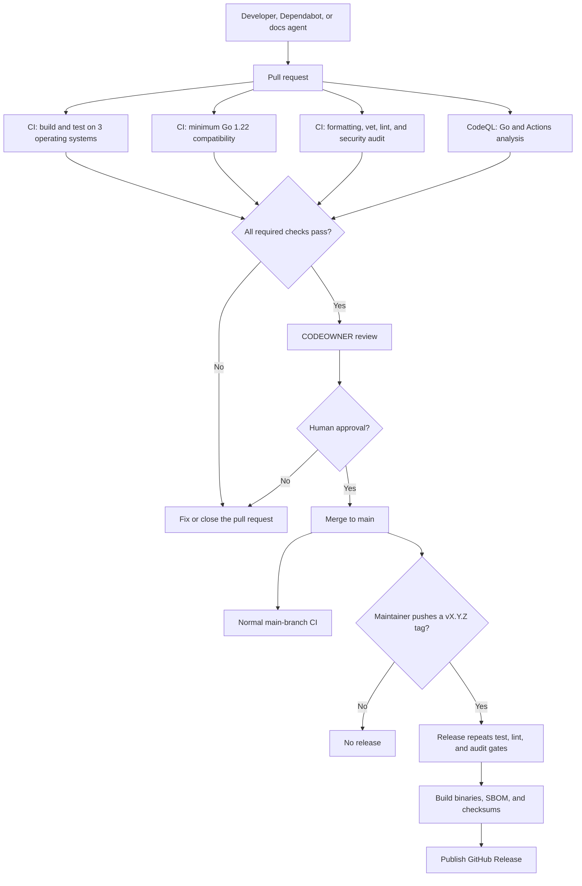

# Automation, CI, and agent operations

This document explains how dorocap changes move from a local edit to a reviewed
merge or release. The central rule is simple: automation may propose or verify
changes, but a human controls merges and releases.

## System flow



There is intentionally no `checks.yml`. The existing `ci.yml` is the single
general verification workflow; a second workflow containing the same commands
would add cost and duplicate status checks without adding a security boundary.

## Automation lanes

| Lane | Trigger | Responsibility | Allowed write |
| --- | --- | --- | --- |
| CI | Push to `main`, pull request, manual | Build, test, compatibility, lint, and vulnerability gates | None |
| CodeQL | Push/PR to `main`, weekly, manual | Semantic analysis of Go and GitHub Actions | Code-scanning results only |
| Dependabot | Monday schedule | Propose GitHub Actions and Go module updates | Dependency pull requests |
| Documentation agent | Wednesday schedule or manual | Detect verified documentation drift | One draft PR limited to `README.md` and `docs/**` |
| Release | A maintainer pushes `v*` | Re-run gates, build artifacts, and publish a release | Release assets and metadata |

These lanes overlap only where defense in depth is useful. Release repeats the
quality gates because a tag can be created independently of a prior workflow
run. The documentation agent runs a small health check for context, but CI is
still the authoritative gate.

## CI checks

`.github/workflows/ci.yml` creates five status checks:

1. `build & test (ubuntu-latest)`
2. `build & test (macos-latest)`
3. `build & test (windows-latest)`
4. `minimum Go compatibility (1.22.x)`
5. `lint & security audit`

The three operating-system jobs use the pinned current Go toolchain and run a
race-enabled, shuffled test suite. The compatibility job verifies the minimum
Go version promised by `go.mod` and the README. The security job runs:

- `gofmt` verification through `make fmt`
- `go vet`
- `staticcheck`
- `golangci-lint`
- `gosec`
- `govulncheck`

`make fmt` is a check: it fails when formatting is wrong and does not rewrite
source files. Developers apply `gofmt` locally and then rerun the check.

All third-party Actions are pinned to full commit SHAs. Dependabot is the lane
that proposes updates to those pins. The `golangci-lint` binary version is also
pinned consistently between CI and release.

## CodeQL

`.github/workflows/codeql.yml` analyzes both `go` and `actions`. Its default
token remains read-only; only the analysis job receives the additional
`security-events: write` permission required to upload results. The scheduled
Saturday run can discover new findings even when the repository has not
changed.

CodeQL is not redundant with `gosec` or `govulncheck`:

- `gosec` checks Go security patterns.
- `govulncheck` correlates reachable code with known Go vulnerabilities.
- CodeQL performs broader semantic/data-flow analysis and also checks workflow
  code.

## Dependabot

`.github/dependabot.yml` owns dependency changes. It runs on Monday in the
`America/Monterrey` timezone and uses separate update queues for GitHub Actions
and Go modules. Minor and patch updates are grouped to reduce PR noise; major
updates remain separate so they receive focused review.

Dependabot never auto-merges in this repository. Its PRs must pass the same CI,
CodeQL, and human review requirements as other changes.

## Documentation agent

The source workflow is `.github/workflows/agent-maintenance.md`; the reusable
agent profile is `.github/agents/maintenance.agent.md`. The workflow imports
that profile and must be compiled into
`.github/workflows/agent-maintenance.lock.yml` before it can run.

The agent follows layered limits:

| Control | Limit |
| --- | --- |
| Schedule | Once weekly, staggered two days after Dependabot |
| Runtime | 30 minutes |
| AI budget | 500 credits per run; 1,000 per rolling 24 hours |
| Concurrency | One active run; redundant pending runs are coalesced |
| Shell commands | Only `go` and `make` entry points |
| Repository token during reasoning | Read-only contents |
| Patch paths | Only `README.md` and `docs/**` |
| Patch size | At most 10 files and 256 KiB |
| Output | At most one draft pull request |
| Merge/release | Forbidden |

`README.md` is normally a protected safe-output file. This workflow explicitly
allows it, but the exclusive `allowed-files` list still rejects every code,
dependency, workflow, security, and engagement-data path. Prompt instructions
are therefore backed by an enforcement boundary.

The agent PR includes an extra authenticated empty commit so GitHub treats it as
a user-authenticated update and starts normal PR CI. Without that mechanism,
PRs created with a workflow token do not trigger other workflows.

## Release gate

`.github/workflows/release.yml` starts only for a pushed `v*` tag and then
rejects tags that do not resemble `v1.2.3` or `v1.2.3-rc.1`. It serializes runs
per tag, installs pinned tools, and executes `make release` before obtaining the
only `contents: write` permission in the conventional workflows.

The release contains:

- Obfuscated binaries for supported macOS and Linux architectures
- A CycloneDX SBOM
- SHA-256 checksums
- GitHub-generated release notes

Creating or pushing the tag remains a human decision. Agents and Dependabot do
not receive tag or release authority.

## Required GitHub configuration

Complete these steps after creating the GitHub repository:

1. Install the Agentic Workflows extension and compile the source workflow:

   ```bash
   gh extension install github/gh-aw
   gh aw validate .github/workflows/agent-maintenance.md
   gh aw compile .github/workflows/agent-maintenance.md
   ```

2. Commit both `agent-maintenance.md` and the generated
   `agent-maintenance.lock.yml`. Recompile whenever its frontmatter, imports, or
   agent profile changes.
3. Create the `agent` and `documentation` labels used by the agent PR.
4. For a personal repository using the Copilot engine, configure
   `COPILOT_GITHUB_TOKEN` as required by gh-aw.
5. Configure `GH_AW_GITHUB_TOKEN` as a fine-grained token scoped only to this
   repository with the minimum Contents and Pull requests write permissions.
   It is used by the isolated safe-output job and to trigger CI; it is not
   exposed to the reasoning container.
6. Keep the repository's default `GITHUB_TOKEN` permission read-only. Grant
   additional permissions at job level only when required.
7. Create a `main` ruleset requiring a pull request, CODEOWNER approval,
   resolved conversations, the five CI checks listed above, `analyze (go)`,
   and `analyze (actions)`.
8. Block force pushes and branch deletion on `main`. Do not enable agent or
   Dependabot auto-merge during the current phase.
9. In Actions settings, restrict allowed Actions where practical and require
   full-length SHA pins.
10. Run the documentation workflow manually once before relying on its weekly
    schedule.

## Failure and recovery behavior

- A failing CI or CodeQL check blocks merge; fix the PR or close it.
- A documentation agent with no verified drift creates no PR.
- An agent patch outside its path or size limits is rejected by safe outputs.
- A missing agent token causes the agent run to fail closed.
- A failed release gate prevents publication. If publication partially fails,
  inspect the draft/release state before retrying; never move or overwrite an
  existing version tag silently.
- Roll back a merged code or documentation change with a normal reviewed revert
  PR. Released versions are immutable; publish a corrected patch version.

## Future phases

The current phase intentionally stops at draft PRs and human merges.

- **Phase 2:** Add build provenance attestations and optional artifact signing
  to releases.
- **Phase 3:** Add structured agent evaluation metrics: no-change rate,
  accepted/rejected corrections, CI pass rate, runtime, and credit use.
- **Phase 4:** Consider narrowly scoped automation for test-only changes. Do
  not extend autonomous edits into evidence capture, hashing, export,
  configuration, workflow, dependency, or release logic.

Any autonomy increase should first be expressed as an enforceable safe-output
policy, tested manually, and only then enabled on a schedule.
